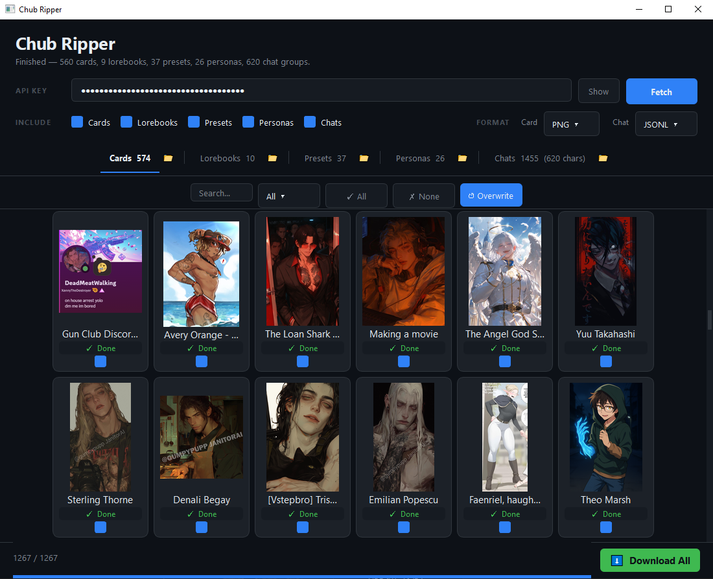

# Chub Ripper
> [!IMPORTANT]
> This plugin was made using AI IDEs like cursor and copilot in visual studio! Most I have done is just test to make sure everything is operational. Thank claude sonnet & opus 4.6 for the code <3

A desktop app that downloads your [Chub.ai](https://chub.ai) character cards, lorebooks, presets, personas, and chat history to your local machine. Runs on Windows, macOS, and Linux.



---

## Requirements

- **Python 3.11, 3.12, or 3.13** — [python.org](https://www.python.org/downloads/)
  - On Windows, check **"Add Python to PATH"** during install

All Python package dependencies are installed automatically by the launch script.

| Package | Purpose |
|---|---|
| `customtkinter` | GUI framework |
| `Pillow` | Image processing for card thumbnails |
| `playwright` | Headless browser used to intercept API calls |
| `requests` | HTTP downloads |

---

## Quick Start

**Windows** — double-click **`run.bat`**

**macOS / Linux** — open a terminal in the folder and run:
```
chmod +x run.sh
./run.sh
```

Both scripts will automatically:
- Install all required Python packages via pip
- Install the Playwright Chromium browser (first run only)
- Launch the app

---

## Manual Setup (optional)

If you prefer to install dependencies yourself:

```
pip install -r requirements.txt
playwright install chromium
python chub_ripper.py
```

---

## Getting Your API Key

1. Open [chub.ai](https://chub.ai) in your browser and log in
2. Open **DevTools** (`F12`)
3. Go to the **Network** tab
4. Click any page on Chub.ai to trigger a network request
5. Look for a request to `ro.chub.ai`
6. Click it, go to **Request Headers**, and copy the value of **`Ch-Api-Key`**

Paste this key into the **Ch-Api-Key** field in the app. It is remembered between sessions so you only need to do this once.

> **Note:** On Windows the key is encrypted at rest using Windows DPAPI. On macOS and Linux it is saved as **plain text** in a `.chub_token` file next to the script, so avoid storing it in a publicly shared folder.

---

## Usage

1. Launch the app via `run.bat`
2. Paste your `Ch-Api-Key` into the field at the top (click **Show** to verify)
3. Check the content types you want to fetch:
   - **Cards** — character card files
   - **Lorebooks** — lorebook files
   - **Presets** — saved presets
   - **Personas** — persona files
   - **Chats** — chat session history
4. Choose your preferred output formats:
   - **Card fmt:** `PNG` (card embedded in image) or `JSON` (raw data)
   - **Chat fmt:** `JSONL`, `JSON`, or `TXT`
5. Click **Fetch** — the app fetches your library and displays tiles with thumbnails
6. Use the **✓ All** / **✗ None** buttons per tab to select or deselect items
7. Click **⬇ Download All** to save everything selected

To cancel a fetch or download in progress, click the button again (it becomes a cancel button).

> **Note:** The app may lag or feel unresponsive while loading a large library (hundreds of cards, presets, personas, etc.). This is normal — thumbnails and tile data are being fetched in the background. Give it a moment and it will catch up.

---

## Output Folders

All files are saved next to `chub_ripper.py`:

```
Chub Ripper/
├── Cards/          ← character card files (.png or .json)
├── Lorebooks/      ← lorebook files
├── Presets/        ← preset files
├── Personas/       ← persona files
├── Chats/          ← chat logs, organized by character
│   └── CharacterName_ID/
│       └── session-name.jsonl (or .json / .txt)
└── debug.log       ← log of the last session (useful for troubleshooting)
```

Items that already exist locally are skipped automatically (shown as **"Already saved"**).

---

## Troubleshooting

**"Could not find Python"** — Install Python 3.11+ and make sure to tick **"Add Python to PATH"** during setup.

**"API key rejected (401/403)"** — Your key has expired or is wrong. Re-copy `Ch-Api-Key` from DevTools.

**Fetch returns 0 items** — Make sure you are logged into Chub.ai in your browser before copying the key, and that the key is not prefixed with `Bearer ` (the app strips this automatically, but double-check).

**App crashes or items fail** — Check `debug.log` in the app folder for details.
